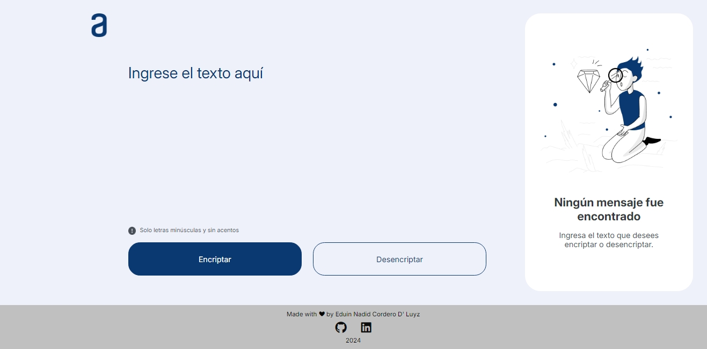
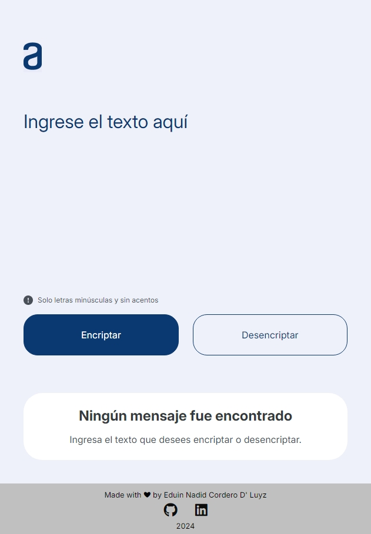
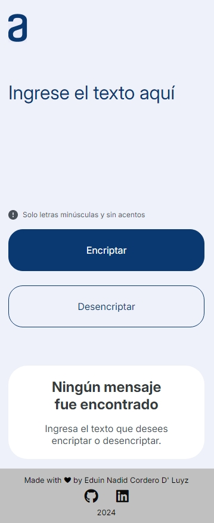

# Encriptador de Textos

Una aplicación web intuitiva y fácil de usar que permite encriptar y desencriptar mensajes de texto. Desarrollada con tecnologías web modernas, esta herramienta asegura la privacidad de tus mensajes con un diseño elegante y adaptable.

## 🎯 Funcionalidades Principales

- **🔐 Encriptación y Desencriptación:** Convierte mensajes de texto en cadenas encriptadas y viceversa con un solo clic.
- **📋 Copiar al Portapapeles:** Funcionalidad para copiar fácilmente los mensajes procesados, optimizando el flujo de trabajo.
- **🛡️ Validación de Entrada:** Acepta solo letras en minúsculas sin acentos, garantizando una encriptación precisa.
- **✨ Animaciones y Efectos:** Incluye transiciones y efectos visuales que enriquecen la experiencia del usuario.
- **📱 Diseño Responsivo:** Adaptable a cualquier dispositivo, asegurando una experiencia de usuario fluida en PC, tabletas y móviles.

## 🖼️ Vistas del Proyecto

### Vista en Escritorio

### Vista en Tablet

### Vista en Móvil

## 🚀 Cómo Usar

1. **Introduce el Texto:** Escribe el mensaje que deseas encriptar o desencriptar.
2. **Encripta o Desencripta:** Utiliza los botones correspondientes para procesar el texto.
3. **Copia el Resultado:** Haz clic en el botón "Copiar" para guardar el resultado en el portapapeles.

## 🛠️ Tecnologías Utilizadas

- **HTML5:** Base estructural de la aplicación.
- **CSS3:** Estilización y diseño visual.
- **JavaScript:** Lógica y funcionalidad interactiva.
- **FontAwesome:** Iconografía utilizada en la interfaz.

---

## 🏷️ Etiquetas

- Encriptación
- Desencriptación
- JavaScript
- CSS
- HTML
- Frontend
- Aplicación Web
- Responsividad
- Alura
